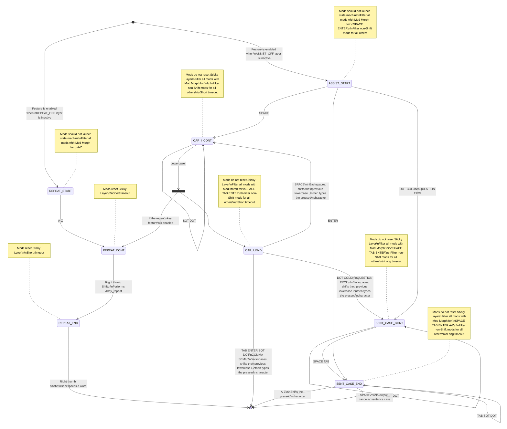

# Colemak-DH 36-Key Layout for Mac & PC
This is my 36-key layout for the Glove80. At first, I used all the keys on the Glove80, but I found myself enjoying the palm rests so much that I would notice every time I moved my hands to reach the outer keys. As a result, I first switched to Colemak DH and then to a 36-key layout to minimize hand movement and maximize use of those comfy, comfy palm rests. Along the way, I really fell down the rabbit hole adding features and learned a ton about ZMK, so I wrote this guide hoping that someone might learn something from my journey.  

## Goals
* Achieve a comfortable typing experience by:
  * Using a more ergonomic arrangement for letters than QWERTY
  * Moving commonly used punctuation (for English prose) to the base layer
  * Implementing intelligent features to reduce typing effort in common situations
  * Using one-handed layers activated by the opposite thumb for text editing, numbers/symbols, and all other functions
  * Adjusting number and symbol shift pairs to enable easily entering common symbols and symbol bigrams (for English prose and Python code)
  * Making text editing as easy and fast and low-friction as possible
* Maintain the ability to enter any modifier chord with any key by placing the modifiers on the home row of each hand
* Easily switch between Mac and PC configurations, with Mac as the default
  * Ensure that Macros and shortcuts work appropriately
  * The most commonly used modifiers should be assigned to the strongest fingers

## Layers
This layout uses a modified Colemak DH base layer, with thumb-activated, cross-hand layers [1] for text editing, numbers and symbols, media keys, and function keys. All of these secondary layers have sticky modifiers, including Hyper, on the off-hand home row [2].  

### Base
* Colemak DH layout for letters
* Common punctuation for English prose [3] is available
* 4 key macro pad on the upper right for commonly used function (not shown)
* "Timerless" home row mods with cross-hand lockout [4] on both hands
* Dynamic repeat key (toggle on/off from System layer)
  * Replaces the right thumb `Shift` key with a repeat key for a single key press after typing any lowercase letter
  * Helps maintain typing rhythm by avoiding tapping the same finger twice when typing double letters
* Smart typing assist (toggle on/off from System layer) [5]
  * Automatically capitalizes the first letter of new sentences by tracking when the previous sentence or paragraph ends
    * Press `Space` to cancel
  * Automatically capitalizes the "I" in I, I'm, I'll, etc.
  * Flexibly handles quotes and whitespace
* Triple-function `Shift` keys with `Caps Word` [6] on each thumb
  * Tap left or right: Sticky `Shift`
  * Double tap left: `Caps Lock`
    * `Caps Lock` activates instantly even with fast taps on Mac OS
  * Double tap right: Delete previous word
  * Tap both: `Caps Word`
* Combo `Q` + `Space` = `Escape`
```
      ┌─────┬─────┬─────┬─────┐                      ┌─────┬─────┬─────┬─────┐
┌─────┤  W  │  F  │  P  │  B  │                      │  J  │  L  │  U  │  Y  ├─────┐
│  Q  ├─────┼─────┼─────┼─────┤                      ├─────┼─────┼─────┼─────┤ ? ! │
├─────┤  R  │  S  │  T  │  G  │                      │  M  │  N  │  E  │  I  ├─────┤
│  A  ├─────┼─────┼─────┼─────┤                      ├─────┼─────┼─────┼─────┤  O  │
├─────┤  X  │  C  │  D  │  V  │                      │  K  │  H  │ , ; │ . : ├─────┤
│  Z  ├─────┴─────┴─────┴─────┘                      └─────┴─────┴─────┴─────┤ ' " │
└─────┘                          ┌─────┐    ┌─────┐                          └─────┘
                           ┌─────┤SHFT │    │ SHFT├─────┐
                           │ SPC ├─────┤    ├─────┤ BSPC│
                           └─────┤ TAB │    │ ENT ├─────┘
                                 └─────┘    └─────┘

      ┌─────┬─────┬─────┬─────┐                      ┌─────┬─────┬─────┬─────┐
┌─────┤     │     │     │     │                      │     │     │     │     ├─────┐
│     ├─────┼─────┼─────┼─────┤                      ├─────┼─────┼─────┼─────┤     │
├─────┤ ALT │ GUI │SHFT │     │                      │     │ SHFT│ GUI │ ALT ├─────┤
│CTRL ├─────┼─────┼─────┼─────┤                      ├─────┼─────┼─────┼─────┤ CTRL│
├─────┤     │     │     │     │                      │     │     │     │     ├─────┤
│     ├─────┴─────┴─────┴─────┘                      └─────┴─────┴─────┴─────┤     │
└─────┘                          ┌─────┐    ┌─────┐                          └─────┘
                           ┌─────┤     │    │     ├─────┐
                           │EDIT ├─────┤    ├─────┤ NUM │
                           └─────┤MEDIA│    │ FUNC├─────┘
                                 └──┬──┘    └──┬──┘
                                    │          │
                                    └──SYSTEM──┘
```

### Text Editing
* Bidirectional word and line selection Macros [7]
  * Tap to select current word or line, then tap any of the selection keys to extend or shrink the selection
  * Mix holds and taps as desired to extend or shrink the selection
  * Named `SELWF`, `SELWB`, `SELLF`, `SELLB` below
* `Alt` + `Copy` = `Select All`
* `Alt` + `Paste` = `Undo`
* Layer lock toggle key enables longer editing sessions without holding the thumb key [8]
  * Tapping left thumb `Shift` while locked will output "LOCKED", pause briefly, then delete the text
* Sticky/toggle tap/hold for activating the number and symbol layer with one hand while using the mouse
```
      ┌─────┬─────┬─────┬─────┐                      ┌─────┬─────┬─────┬─────┐
┌─────┤     │     │HYPR │     │                      │ CUT │ HOME│ PGDN│ PGUP├─────┐
│     ├─────┼─────┼─────┼─────┤                      ├─────┼─────┼─────┼─────┤ END │
├─────┤ ALT │ GUI │SHFT │LOCK │                      │ COPY│ LEFT│ DOWN│  UP ├─────┤
│CTRL ├─────┼─────┼─────┼─────┤                      ├─────┼─────┼─────┼─────┤RIGHT│
├─────┤     │     │ NUM │     │                      │PASTE│SELWB│SELLF│SELLB├─────┤
│     ├─────┴─────┴─────┴─────┘                      └─────┴─────┴─────┴─────┤SELWF│
└─────┘                          ┌─────┐    ┌─────┐                          └─────┘
                           ┌─────┤     │    │ INS ├─────┐
                           │     ├─────┤    ├─────┤     │
                           └─────┤     │    │     ├─────┘
                                 └─────┘    └─────┘
```

### Numbers & Symbols
* Custom shifted number and symbol pairs [9]
  * Common bigrams can be rolled
  * Most common single symbols assigned to index finger and thumb
  * Double taps with pinky avoided
  * `:` and `!` duplicated from base layer to enable easy smileys `:)` and `!=`
* Autoshift for all numbers and symbols [1]
* Layer lock toggle key enables longer number entry sessions without holding the thumb key [8]
  * Tapping right thumb `Shift` while locked will output "LOCKED", pause briefly, then delete the text
* Sticky/toggle tap/hold for activating the editing layer with one hand while using the mouse
```
      ┌─────┬─────┬─────┬─────┐                      ┌─────┬─────┬─────┬─────┐
┌─────┤ 7 [ │ 8 ] │ 9 * │ / & │                      │     │ HYPR│     │     ├─────┐
│ \ ^ ├─────┼─────┼─────┼─────┤                      ├─────┼─────┼─────┼─────┤     │
├─────┤ 4 ( │ 5 ) │ 6 = │ # | │                      │ LOCK│ SHFT│ GUI │ ALT ├─────┤
│ : ! ├─────┼─────┼─────┼─────┤                      ├─────┼─────┼─────┼─────┤ CTRL│
├─────┤ 1 { │ 2 } │ 3 $ │ ` ~ │                      │     │ EDIT│     │     ├─────┤
│ @ % ├─────┴─────┴─────┴─────┘                      └─────┴─────┴─────┴─────┤     │
└─────┘                          ┌─────┐    ┌─────┐                          └─────┘
                           ┌─────┤ - + │    │     ├─────┐
                           │ 0 _ ├─────┤    ├─────┤     │
                           └─────┤ < > │    │     ├─────┘
                                 └─────┘    └─────┘
```

### Media
* Custom shortcuts for setting the volume to minimum and microphone mute/unmute on Mac (bind at OS level)
* Screen lock and power shortcuts for Mac and PC
```
      ┌─────┬─────┬─────┬─────┐                      ┌─────┬─────┬─────┬─────┐
┌─────┤     │     │HYPR │     │                      |     │VLMIN│ MUTE│VOLDN├─────┐
│     ├─────┼─────┼─────┼─────┤                      ├─────┼─────┼─────┼─────┤VOLUP│
├─────┤ ALT │ GUI │SHFT │     │                      |     │ MIC │ P/P │ PREV├─────┤
│CTRL ├─────┼─────┼─────┼─────┤                      ├─────┼─────┼─────┼─────┤ NEXT│
├─────┤     │     │     │     │                      |     │ LOCK│POWER│BRIDN├─────┤
│     ├─────┴─────┴─────┴─────┘                      └─────┴─────┴─────┴─────┤BRIUP│
└─────┘                          ┌─────┐    ┌─────┐                          └─────┘
                           ┌─────┤     │    │ DEL ├─────┐
                           │     ├─────┤    ├─────┤ BSPC│
                           └─────┤     │    │     ├─────┘
                                 └─────┘    └─────┘
```

### Function
```
      ┌─────┬─────┬─────┬─────┐                      ┌─────┬─────┬─────┬─────┐
┌─────┤ F7  │ F8  │ F9  │PSCRN│                      │     │ HYPR│     │     ├─────┐
│ F12 ├─────┼─────┼─────┼─────┤                      ├─────┼─────┼─────┼─────┤     │
├─────┤ F4  │ F5  │ F6  │SLCK │                      │     │ SHFT│ GUI │ ALT ├─────┤
│ F11 ├─────┼─────┼─────┼─────┤                      ├─────┼─────┼─────┼─────┤ CTRL│
├─────┤ F1  │ F2  │ F3  │PAUSE│                      │     │     │     │     ├─────┤
│ F10 ├─────┴─────┴─────┴─────┘                      └─────┴─────┴─────┴─────┤     │
└─────┘                          ┌─────┐    ┌─────┐                          └─────┘
                           ┌─────┤ ESC │    │     ├─────┐
                           │ SPC ├─────┤    ├─────┤     │
                           └─────┤     │    │     ├─────┘
                                 └─────┘    └─────┘
```

### System
* Accessed by holding Media and Function layers simultaneously
* RGB controls on left hand
* Bluetooth controls on right hand; single-tap to connect, double-tap to disconnect
* Double tap to confirm clearing Bluetooth profile(s)
  * Due to a ZMK bug [10], bootloader and reset behaviors are not available with double taps; single tap for these
* Bootloader and reset available on both hands
* The top three innermost keys on each hand control the dynamic repeat key, smart typing assist and Mac/PC mode features
  * From outside in: Dynamic repeat key, smart typing assist, Mac/PC mode
  * Turn on the dynamic repeat key and smart typing assist features or switch to Mac mode with the left hand
  * Turn off the dynamic repeat key and smart typing assist features or switch to PC mode with the right hand
```
      ┌─────┬─────┬─────┬─────┐                      ┌─────┬─────┬─────┬─────┐
┌─────┤ RST │RPTON│ASTON│ MAC │                      │  PC │ASTOF│RPTOF│ RST ├─────┐
│BOOT ├─────┼─────┼─────┼─────┤                      ├─────┼─────┼─────┼─────┤ BOOT│
├─────┤RSAI │RHUI │RBRI │RTOG │                      │ OUSB│ BT0 │ BT1 │ BT2 ├─────┤
│RSPI ├─────┼─────┼─────┼─────┤                      ├─────┼─────┼─────┼─────┤ BT3 │
├─────┤RSAD │RHUD │RBRD │REFF │                      │BCALL│BTCLR│     │     ├─────┤
│RSPD ├─────┴─────┴─────┴─────┘                      └─────┴─────┴─────┴─────┤     │
└─────┘                          ┌─────┐    ┌─────┐                          └─────┘
                           ┌─────┤     │    │     ├─────┐
                           │     ├─────┤    ├─────┤     │
                           └─────┤     │    │     ├─────┘
                                 └─────┘    └─────┘

```

## Other Features
* `Caps Word` allows `Underscore` and `Minus` [11]
* Faster, quick release Sticky Keys
* Faster Sticky Layers
* OS switching; Mac is default, PC is accessed with a toggle via a double tap on the System layer
  * Swaps `GUI` and `Ctrl` on all layers
  * Updates text editing shortcuts and Macros

## Implementation Details
This keymap makes use of a *lot* of ZMK behaviors; it has over 900 lines of custom behaviors, Macros, and other configuration, as well as 30 layers. Much of this configuration is abstracted using C preprocessor macros similar to urob's `zmk-nodefree-config` [12]; this greatly reduces the amount of boilerplate and makes adding new features much easier. Below is some information on how some of the more complicated and unusual features are implemented.  

### Home Row Mods
The home row mods are configured to never activate when typing quickly or when using one-handed rolls, but they can be activated immediately without waiting for the tapping term to expire when pressed deliberately. This results in a low false positive rate and no delay when mods are needed, and feels very natural to use.  

See urob's page [4] for more details and instructions for how to tune the configuration if you experience accidental activations (false positives) or can't get them to activate when you want them to (false negatives).  

### Dynamic Repeat Key & Smart Typing Assist
#### State Machines in ZMK
The dynamic repeat key and smart typing assist features are implemented as state machines. State machines can be modeled in ZMK keymaps by using layers to represent states and Macros to represent state transitions. Each state transition macro presses a key or other binding and then activates the next state layer. Layers can be activated using a Sticky Layer Behavior to ensure that the state machine is reset if next key press does not continue the state machine with another state transition. Modifiers can be filtered out using Mod Morph to ensure that keyboard shortcuts always have their expected behavior and do not continue the state machine.  

Each state machine is defined by:
  1. Defining one or more Sticky Layer Behaviors
  2. Defining helper C macros for creating state transition Macros using those behaviors, for each state in the state machine
  3. Defining the state transition Macros themselves, for each character in each state in the state machine
  4. Wrapping the state transition Macros in filtering Mod Morphs to ensure keyboard shortcuts work as expected
  5. Further wrapping those state transitions in Hold Taps and Mod Morphs as needed
  6. Assigning the Hold Taps, Mod Morphs & Macros to the keymap

Several helper C macros assist in setting all of this up, but it's still a lot of boilerplate. Crucially, the main state transition macro supports holding and rolling keys for repeated presses and/or fast typing while still progressing the state machine. Helper C macros for defining the Sticky Layer behaviors and for defining Mod Morphs to filter out modified key presses are also available.  

#### Dynamic Repeat Key
The dynamic repeat key feature tracks when a lowercase letter is typed, and then replaces the right thumb `Shift` key with a `&key_repeat` Behavior for a single key press. This enables typing double letters without tapping the same finger twice, which can help preserve typing rhythm and speed. The feature ignores uppercase letters because `&key_repeat` would cause the second letter to be uppercase as well; this is rarely desired. Incidentally, this also preserves the ability to use the right thumb `Shift` key when typing acronyms (if `Caps Word` isn't used). Through use of a follow-on state after `&key_repeat`, the ability to double tap the right thumb `Shift` to delete a word is preserved. This could also be accomplished with a Tap Dance, but that would introduce a delay on the `&key_repeat` behavior, and delay when typing regular letters can feel very jarring. A timeout can be configured (see the `REPEAT_KEY_TIMEOUT_MS` definition), and by default is relatively short; an even shorter timeout `REPEAT_KEY_BACKSPACE_WORD_TIMEOUT_MS` controls how long the final state that enables deleting a word stays active. This feature defaults to on and can be toggled off from the System layer.  

#### Smart Typing Assist
The smart typing assist feature tracks when sentences or lines end (either with `.`, `?`, `!` or `:` followed by whitespace or after `Enter`) and capitalizes the next letter, as well as tracking when the letter "I" should be capitalized (such as in I, I'm, I'll, etc.) and automatically correcting it. It supports whitespace and quotes dynamically, and it does not interfere with keyboard shortcuts and modifiers. Pressing `Space` will cancel the capital letter at the beginning of a new sentence; this actually uses the `K_CANCEL` keycode which is unused by all operating systems. Timeouts can also be configured (see the `SENT_CASE_TIMEOUT_MS` and `CAP_I_TIMEOUT_MS` definitions); by default the sentence case component has a long timeout to account for gathering thoughts before beginning another sentence or paragraph and the capital I component has a relatively short timeout. This feature defaults to on and can be toggled off from the System layer.  

This was inspired by the sentence case feature on rafaelromao's layout; see their page [5] for all sorts of other interesting ideas.  

#### Diagram
The state machine diagram for the dynamic repeat key and smart typing assist features is below. A single transparent Conditional Layer enables the capital I component of the smart typing assist feature to also activate the repeat key feature; this is represented by the fork in the diagram after the `CAP_I_CONT` state/layer. This allows both features to be toggled on/off independently and still interoperate as expected.  



### Custom Number & Symbol Pairs
This layout makes extensive use of the Mod Morph behavior to customize which numbers and symbols are paired together. This enables full customization of the punctuation on the base layer, and is used on every single number or symbol key on the number layer. Number layer keys are also autoshifted (like in the Miryoku layout [1]), so that holding the key slightly longer results in the assigned shifted symbol.  

Base layer punctuation placement was informed by frequency analysis of the most common punctuation in English prose [3], and the symbol layer was designed with the principles laid out by Pascal Getreuer in his post about his symbol layer [9].  

The triple-function `Shift` keys [6] are also implemented with Mod Morph, except tapping both to activate `Caps Word` which is a Combo to prevent accidental activation when rapidly alternating `Shift` keys on each thumb.  

### Word & Line Selection
The editing layer has 4 Macros for text selection adapted from Pascal Getreuer's QMK implementation [7]. They correspond to forward and backward moving selection for words and lines. A single press of any of these will select the current word or line; subsequent presses will extend the selection in the corresponding direction. Pressing any of the other selection keys will extend or shrink the selection accordingly. Holding any of the keys down causes the selection to be continually extended or shrunk until the key is released. Pressing any other key (often `Cut`, `Copy`, or `Backspace`) breaks out of the Macro. A timeout can also be configured (see the `SELECT_TIMEOUT_MS` definition), but by default is set so high as to not matter.  

Several ZMK features interact to make this possible. After selecting the current word or line, the final action in each Macro is to activate a Sticky Layer that replaces the pressed key with a continuation Macro that continues the selection. This is necessary because the initial selection Macro must first jump to the beginning or end of the word or line to ensure the entire thing is selected, but that behavior is not desireable when extending or shrinking the selection. The continuation Macro then resets the same Sticky Layer so that the selection can be continued for as long as desired. For the selection key presses themselves, the `macro_pause_for_release` behavior is used to enable holding the key down to quickly extend or shrink the selection. Finally, the continuation layer is controlled by an entirely transparent Conditional Layer which ensures that that layer is only active when the Editing layer is also active; this means that it's rarely necessary to even press a key to leave the continuation layer.  

The Macros have Mac and PC versions that are swapped when switching the OS mode, since the operating systems use different key shortcuts for jumping words and lines.  

This feature is fundamentally a (simple) state machine, and so uses the state machine helper macros to simplify implementation.  

### Layer Locks
There's no way to use standard ZMK behaviors to lock a layer on when you're holding an `&mo` key to get to that layer; once you release the `&mo` key, the layer will deactivate no matter what. The solution is to use Conditional Layers, which can activate a layer if other layers are active. Say you have 4 layers:

* **0** - Base
* **1** - Editing (has all your text editing keys)
* **2** - Editing Momentary (fully transparent)
* **3** - Editing Toggle (fully transparent)

First, setup 2 conditional layer conditions, so that layer 1 is active if either layer 2 or 3 is active. Then, put an `&mo 2` key on layer 0, and a `&tog 3` key on layer 1. Now you can hold the key on the base layer, your layer condition will turn on the editing layer, and then you have the option of locking it on so you can release the first key.  

A minimal example of this approach can be found on the ZMK issue tracker in a comment I wrote. [8]  

An extra detail: Whenever the editing or numbers layer is locked on like this, the layer switching features are removed from the thumb keys. This helps ensure that it's not possible to accidentally lock more than one layer on at a time. Also, the same-side thumb `Shift` key is replaced with a macro that will type "LOCKED", pause briefly, then delete the text. This can be helpful to determine what state the keyboard is in.   

### OS Switching
OS switching is also implemented with Conditional Layers. When switching to PC mode, a layer is activated on top of the base layer to swap the order of the home row mods, since `Ctrl` is much more commonly used than `GUI` on PC's, and the reverse is true on Macs. The shortcut for deleting the previous word when double tapping the right `Shift` key is also switched out. Additional layer conditions make the same swaps for all the other layers, as well as switching out editing layer Macros and shortcuts to use PC keys and modifiers.  

### One-Handed Numbers
It's possible to access the number layer with the left hand by using the sticky/toggle key on the editing layer; this allows typing numbers one handed when using the mouse, if you're right handed like me. This is also implemented with Conditional Layers by turning on the transparent toggle layer that corresponds with the number layer, either for a single key press or until toggled off. This choice is handled with a Hold Tap; hold the key down to lock the number layer on, or tap it to set it as a Sticky Layer. The Sticky Layer option makes it possible to perform keyboard shortcuts that use numbers one-handed, after queueing one or more sticky modifiers on the editing layer.  

### Changing Caps Word Behavior
The ZMK docs provide instructions for how to update the behavior of `Caps Word` to allow for additional keys without deactivating, but it requires setting an option at the root level of the keymap, which is not supported by the Glove80 layout editor. Fortunately, fellow Glove80 user Sunaku [11] discovered how to override the underlying behavior instead; that method is used here.  

### Fast Macros
By default, most of the ZMK Macros on this keymap are setup to go as fast as possible with 0ms tap and wait times. If you find that this causes issues on your system, you can increase the timings by setting the `FAST_MACRO_TAP_MS` and `FAST_MACRO_WAIT_MS` definitions to a higher number.

## References
[1] Miryoku: https://github.com/manna-harbour/miryoku/tree/master/docs/reference
[2] Callum: https://github.com/qmk/qmk_firmware/tree/master/users/callum
[3] Vivian Cook: http://www.viviancook.uk/Punctuation/PunctFigs.htm
[4] urob: https://github.com/urob/zmk-config#timeless-homerow-mods
[5] rafaelromao: https://github.com/rafaelromao/keyboards/blob/main/docs/base.md#sentence-case
[6] urob: https://github.com/urob/zmk-config#capsword
[7] Pascal Getreuer: https://getreuer.info/posts/keyboards/select-word/index.html
[8] ZMK: https://github.com/zmkfirmware/zmk/issues/1299#issuecomment-1667045948
[9] Pascal Getreuer: https://getreuer.info/posts/keyboards/symbol-layer/index.html#my-symbol-layer
[10] ZMK: https://github.com/zmkfirmware/zmk/issues/1494
[11] Sunaku: https://my.glove80.com/#/layout/user/40051a98-85e3-4566-bfc9-5f43986ae9f9
[12] urob: https://github.com/urob/zmk-nodefree-config

## Changelog
For a detailed changelog, see my thread on the Glove80 Discord: https://discord.com/channels/877392805654306816/1119252160744534067/1119252181820903486